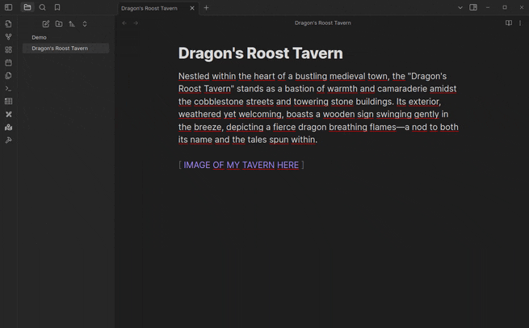
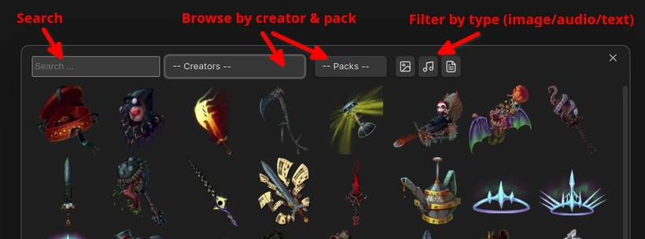

# Moulinette Plugin for Obsidian

[Moulinette](https://www.moulinette.cloud/) is a content distribution platform tailored for tabletop roleplaying games (TTRPGs). 
It's designed with game masters in mind, streamlining the preparation process for role-playing campaigns and game sessions.

This plugin implements integration with Moulinette Cloud, providing the following capabilities:
* Search for images, sounds, and music, download them, and easily integrate them into your notes.
* Search for and download Obsidian notes (rules, snippets, tables, etc.)



The content is provided by your beloved communities and creators, encompassing both free offerings and premium assets for those who choose to support them.
Visit [Moulinette Marketplace](https://assets.moulinette.cloud/marketplace/creators) to browse available content.

* **Payment is required** for full access but some content is available for free. To access premium content from available creators, you must support both the creator and moulinette.
* **Network use**. The plugin performs searches on [assets.moulinette.cloud](https://assets.moulinette.cloud) and downloads content from cloud storages.
 
# First steps

* Install the plugin (see instructions below)
* Execute command `Open Moulinette Browser`
* Search, browse, filter and download assets from available creators



* See also [Moulinette Obsidian Demo](https://github.com/SvenWerlen/moulinette-obsidian-demo) repository for examples you can search and play with.

# How to install the plugin

* Download the [latest release](https://github.com/SvenWerlen/moulinette-obsidian-plugin/releases)
* Place the unzipped folder plugin into `your vault` > `.obisidan` (hidden folder) > `plugins`
* Folder structure should look like this :

```
Your Vault/
   .obsidian/
      plugins/
         moulinette-plugin/
            main.js
            manifest.json
            styles.css
```

* Restart Obsidian
* Enable the module
* Enjoy!